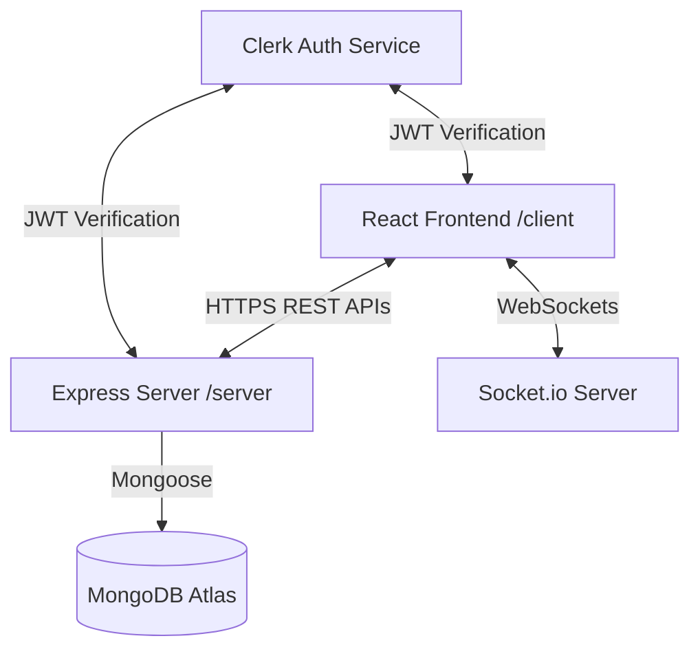

# DocStudio — Production-Ready Collaborative Document Platform

A full-stack, recruiter-impressive collaborative document studio similar to Google Docs. Designed with modern web technologies, robust security middlewares, real-time WebSockets synchronization, stateful presence indicators, and complete version snapshot history.

---

## 🚀 Key Features

### 💻 Rich-Text & Stateful Collaboration
- **Real-Time Sync**: Multiple editors typing concurrently on the same canvas with conflict-free syncing over WebSockets.
- **Active Presence**: Display of active collaborator avatar lists in the navigation bar.
- **Live Cursors**: High-contrast colored cursors labeled with collaborator names tracking their active selection ranges.
- **Word & Char Counter**: Real-time stats calculation shown in an info panel.
- **Auto-Save**: Automatic save syncing to MongoDB Atlas every 2 seconds with "Saving...", "Saved", and "Offline" status badges.
- **Offline Mode resilience**: Gracefully notifies user when connection is lost, queuing inputs, and auto-syncing once connected.

### 🎛️ Dashboard & Document Control
- **Filters & Tabs**: Categorized directories for Recent, Owned by Me, Shared with Me, Starred, and Trash.
- **Template Gallery**: Start instantly with custom pre-seeded templates (Blank, Resume, Meeting Notes, Project Proposal, Letter).
- **Search & Sorts**: Instant title search and filtering dropdown (Date modified, Date created, Title alphabetically).
- **Grid/List View**: Toggle viewports to match preferences.
- **Context Operations**: Quick inline renaming, document duplication, starring toggles, soft-trashing, and permanent trashing.

### 🕰️ Version Snapshots & Backups
- **Manual Snapshots**: Take structured checkpoints of content state with custom descriptions (e.g. "Milestone V1").
- **Backups Sidebar**: Complete listing of saved historical snapshots.
- **Preview & Revert**: Enter read-only preview of any past version and restore the editor to that state instantly.

### 🔒 Granular Share Permissions
- **Link Sharing**: Toggle between Restricted (only invited members) and Public (anyone with link).
- **Global Permission**: Configure public link access (Viewer vs. Editor).
- **Invites**: Invite specific collaborators by email. Integrates with Clerk to lookup profile details on addition.

---

## 🛠️ Technology Stack

| Layer | Technologies |
| :--- | :--- |
| **Frontend** | React (Vite), Tailwind CSS v4, Clerk Auth, Quill, Socket.io-client |
| **Backend** | Node.js, Express, Socket.io, Mongoose (MongoDB Atlas), @clerk/backend |
| **Security** | Helmet, CORS, Express-Rate-Limit, JWT Token validation |
| **Tooling** | Zod (Validation), Concurrently, Lucide Icons, Canvas-Confetti |

---

## 📐 System Architecture



---

## 💻 Folder Structure

```
├── client/                 # React Client Application
│   ├── src/
│   │   ├── components/     # Reusable Components (ShareModal, Toasts)
│   │   ├── context/        # Theme & Auth Contexts
│   │   ├── pages/          # LandingPage, Dashboard, Editor
│   │   ├── utils/          # apiRequest Fetch client
│   │   ├── index.css       # Tailwind CSS v4 configs
│   │   └── main.jsx        # App entry point
│   ├── vite.config.js      # Vite and Tailwind config
│   └── package.json
│
├── server/                 # Express REST & Sockets Server
│   ├── src/
│   │   ├── config/         # Database and Zod env validations
│   │   ├── middleware/     # Clerk Auth, error catcher, rate limiter
│   │   ├── models/         # Document & Version Mongoose Schemas
│   │   ├── routes/         # Document CRUD REST routing
│   │   └── sockets/        # CollabSocket.io synchronization
│   ├── src/index.js        # Server entry point
│   └── package.json
│
└── package.json            # Root monorepo orchestration script
```

---

## 🔑 API Documentation

### Document Endpoints
All endpoints (except `GET /api/documents/:id` when the document is marked public) require a Bearer token in the `Authorization` header.

| Method | Endpoint | Description | Scope |
| :--- | :--- | :--- | :--- |
| **GET** | `/api/documents` | List user's documents (Recent/Owned/Starred/Trash) | Authenticated |
| **POST** | `/api/documents` | Create document from template (`blank`/`resume`/etc) | Authenticated |
| **GET** | `/api/documents/:id` | Fetch document content and permission | Public/Private |
| **PUT** | `/api/documents/:id` | Update metadata (title/starring) | Owner/Editor |
| **POST** | `/api/documents/:id/duplicate` | Duplicate document content | Owner/Editor/Viewer |
| **POST** | `/api/documents/:id/star` | Toggle document star rating | Authenticated |
| **DELETE** | `/api/documents/:id` | Soft-trash or permanently delete document | Owner |
| **POST** | `/api/documents/:id/restore` | Restore soft-deleted document from trash | Owner |
| **POST** | `/api/documents/:id/share` | Update public access, invite collaborator | Owner |

### Version History Endpoints

| Method | Endpoint | Description | Scope |
| :--- | :--- | :--- | :--- |
| **GET** | `/api/documents/:id/versions` | List all historical snapshots | Owner/Editor/Viewer |
| **POST** | `/api/documents/:id/versions` | Save a manual snapshot | Owner/Editor |
| **POST** | `/api/documents/:id/versions/:versionId/restore` | Restore document to version snapshot | Owner/Editor |

---

## ⚙️ Local Development Installation

### Prerequisites
- Node.js installed (v18+)
- MongoDB Atlas database cluster
- Clerk Account (Free) for authentication credentials

### Steps

1. **Clone the repository**:
   ```bash
   git clone <repository_url>
   cd project
   ```

2. **Configure Backend Environments**:
   Create a `.env` file in `/server` copying `/server/.env.example`:
   ```env
   PORT=5000
   MONGODB_URI=mongodb+srv://<username>:<password>@cluster.mongodb.net/docs-clone
   CLERK_SECRET_KEY=sk_test_...
   CORS_ORIGIN=http://localhost:5173
   NODE_ENV=development
   ```

3. **Configure Frontend Environments**:
   Create a `.env` file in `/client` copying `/client/.env.example`:
   ```env
   VITE_CLERK_PUBLISHABLE_KEY=pk_test_...
   VITE_API_URL=http://localhost:5000
   ```

4. **Install all packages concurrently**:
   ```bash
   npm run install:all
   ```

5. **Start Dev Servers (Concurrently)**:
   ```bash
   npm run dev
   ```
   - Client is hosted at: `http://localhost:5173`
   - Server APIs are hosted at: `http://localhost:5000`

---

## 🚢 Production Deployment

### Frontend (Vercel)
1. Set up a new project on Vercel importing the `/client` directory.
2. In Environment Variables, configure:
   - `VITE_CLERK_PUBLISHABLE_KEY`: (Your Clerk Publishable Key)
   - `VITE_API_URL`: (Your Render server URL, e.g. `https://api.yourdomain.com`)
3. Deploy!

### Backend (Render)
1. Create a new Web Service on Render, linking your Git repository.
2. Set Build Command: `npm install`
3. Set Start Command: `npm start`
4. Set the Root Directory to `server`.
5. In Environment Variables, configure:
   - `MONGODB_URI`: (Your MongoDB Atlas connection URI)
   - `CLERK_SECRET_KEY`: (Your Clerk Secret Key)
   - `CORS_ORIGIN`: (Your Vercel site URL, e.g. `https://your-app.vercel.app`)
   - `NODE_ENV`: `production`
6. Deploy!
